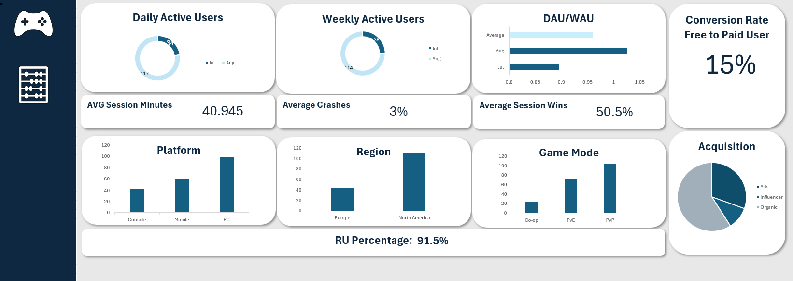

# Player Engagement and Monetization Analysis (Excel Dashboard)

## Dashboard Preview

Here is a snapshot of the interactive Excel dashboard created for this project:

## Overview
This project analyzes **200+ video game session records** to explore player engagement and monetization patterns. The data was cleaned and structured in Excel, then transformed into an **interactive dashboard** highlighting key KPIs.

## Objectives
- Practice **end-to-end Excel analysis**: data cleaning, EDA, visualization, and storytelling.  
- Track and interpret **gaming KPIs**: DAU/WAU, win rates, conversion to paying users, and session behavior.  
- Build a **portfolio-ready dashboard** demonstrating applied data analytics skills.  

## Dataset
- ~200 player session records (sample data)  
- Columns include: `date`, `user_id`, `platform`, `region`, `game_mode`, `session_minutes`, `matches_played`, `wins`, `latency_ms`, `spend_usd`, and more.  

## Analysis Steps
1. **Data Cleaning** – removed duplicates, flagged impossible values, standardized region names.  
2. **Exploratory Analysis** – PivotTables to calculate KPIs and segment performance.  
3. **Visualization** – charts, KPI tiles, and slicers for interactivity.  
4. **Storytelling** – insights framed around player engagement, retention, and monetization.  

## Key Insights
- DAU/WAU ratio shows strong stickiness among North American players.  
- PvP sessions had higher conversion rates to paying users compared to PvE.  
- Mobile sessions were shorter but monetized at a higher rate per active user.  

## Deliverables
- 📊 Excel dashboard with dynamic charts and KPIs  
- 📈 Business insights and recommendations  

## Skills Demonstrated
- Data cleaning & validation in Excel  
- PivotTables & calculated fields  
- KPI tracking and visualization  
- Dashboard design for portfolio review  

---

### How to Use
1. Download the Excel file from this repository.  
2. Open in Excel and interact with the dashboard (slicers, charts, KPIs).  
3. Review insights for player engagement and monetization trends.  
